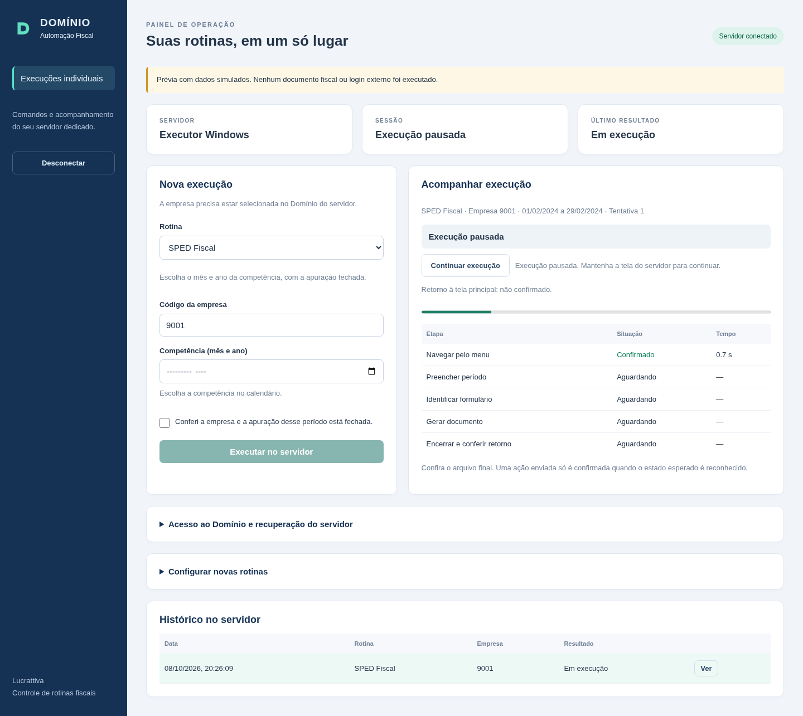
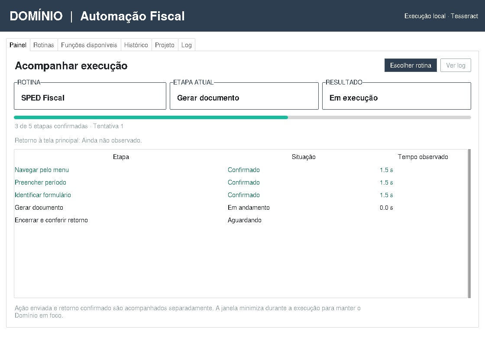

# Domínio Automation Engine

Motor de automação para operar o **Domínio Escrita Fiscal** (Thomson
Reuters) pela interface, para a Lucrattiva Contabilidade — começando por
uma rotina ligada a SPED. Projeto irmão do
[`docauto`](https://github.com/cristiane-art/Testes-Para-Automa-o) (que
organiza documento fiscal que **chega** ao escritório); este aqui **opera
o próprio Domínio**, risco maior, repositório separado de propósito.

## Onde encontrar os instaladores e atalhos

Na raiz ficam apenas `Instalar Servidor.bat`, `Instalar Interface.bat`,
`Instalar.bat` (motor local) e `Atualizar.bat`.

Os demais atalhos continuam disponíveis, organizados por finalidade:

| Pasta | Uso |
| --- | --- |
| `atalhos/servidor/` | Abrir servidor, configurar rede, liberar acesso, simular e executar |
| `atalhos/interface/` | Abrir a interface gráfica local, completa ou de operador |
| `atalhos/ocr/` | Instalar Python/Paddle opcionais e avaliar OCR |
| `atalhos/ferramentas/` | Calibrar tela, diagnosticar PDF, listar funções e abrir o menu SPED |

Veja o [índice dos atalhos](atalhos/README.md). Todos os 21 arquivos BAT
foram preservados; apenas os caminhos dos auxiliares mudaram. Pode abrir
os atalhos por duplo clique dentro de suas pastas. Esta organização não
exige reinstalar aplicativos ou apagar `data/`.

## Site conectado ao servidor

O projeto agora inclui uma interface web para enviar tarefas individuais
ou lotes por empresa ao executor dedicado, acompanhar etapas e consultar histórico. Pode ser
instalada no PC como aplicativo pelo Chrome/Edge. A GUI local continua
disponível para manutenção, calibração e gravação de rotinas.

Para testar: `Atualizar.bat` → `Instalar Servidor.bat` →
`atalhos/servidor/Testar Interface Servidor.bat`. O teste é simulado e não opera o Domínio.
Consulte [instalação, conexão e execução real](docs/SERVIDOR-E-INTERFACE.md).
O servidor informado ainda precisa do Domínio configurado.

Para dois PCs na mesma rede, existem dois instaladores: **Servidor**
no PC com Domínio e **Interface** no outro. O instalador do servidor
prepara HTTPS e gera `data/rede_local/interface_cliente`, uma pasta
pequena para copiar ao outro PC. O cliente cria um atalho em janela
própria pelo Edge/Chrome, sem instalar Python/OCR/Domínio. Siga o
[passo a passo da rede local](docs/SERVIDOR-E-INTERFACE.md).

A interface agora oferece Pausar/Continuar na tarefa ativa, calendário
obrigatório (competência ou datas), login Onvio com código humano,
cancelamento/reinício, captura temporária e calibração da tela do servidor.
Configurar novas rotinas salva rascunhos compatíveis com o gravador para
revisão e teste; ainda não executa rascunhos remotamente. Cadastre regimes
com as rotinas integradas na ordem escolhida e atribua um regime a cada
empresa. O lote faz todas as rotinas da empresa antes de trocar para a
próxima, com calendário, revisão, pausa e interrupção. Falha ou retorno
não confirmado interrompe o restante. Agendamento é futuro no
[roadmap](docs/ROADMAP-RPA.md). Lote, novos controles e login precisam da
rodada Windows; testes da nuvem usam execução e autenticação simuladas.



## Estado atual: consolidar execução e recuperação — incremento 2 do RPA

👉 **[docs/00-analise-e-plano-fase0.md](docs/00-analise-e-plano-fase0.md)**
— riscos técnicos, achados confirmados (Domínio é entregue via GraphOn
GO-Global, não local), arquitetura recomendada, roadmap e o histórico
completo de cada descoberta técnica. **Leia isso antes de mexer em
qualquer coisa neste repositório** — economiza reaprender o que já foi
resolvido na marra (foco de janela, recorte de OCR, etc).

Já validado com o Domínio de verdade: ler estado da tela (empresa,
período, menu) por OCR, achar posição de texto pra clicar, focar a
janela antes de agir, clicar e passar o mouse (hover) de forma real,
navegar sozinho até a tela de geração da EFD ICMS/IPI (SPED Fiscal),
clicar OK, **confirmar sucesso da geração ("Final da exportação.")** e
fechar a tela sozinho — ponta a ponta, sem intervenção manual no meio
(seção 0.11 do documento acima).

Rodadas posteriores incluíram empresas reais e EFD Contribuições;
o histórico registra o mecanismo observado em cada versão. Ainda falta
comparar o conteúdo com uma obrigação já entregue. No SPED, o período
é selecionado sozinho: o mês anterior ao atual (seção 0.23). Antes de
rodar, confirme a empresa e que a apuração dessa competência está
fechada; o calendário sozinho não comprova fechamento.

O caminho até agentes de IA operarem rotinas pela interface está em
[docs/ROADMAP-RPA.md](docs/ROADMAP-RPA.md). O incremento atual acompanha
as quatro rotinas conhecidas por etapas, com linhas `[estado]` no console/interface
e eventos locais em `data/execucoes/<id>.jsonl`. Uma falha indica a etapa
em que parou; uma ação enviada é distinguida de um estado observado.
O caminho de falha na conferência foi observado no Windows. A captura
seguinte mostrou o Adobe Acrobat em primeiro plano após salvar o PDF,
enquanto a prévia do Domínio permaneceu aberta. Agora o motor guarda a
janela associada à prévia reconhecida, tenta devolver o foco a ela e só
envia Esc com o foco confirmado. Se não conseguir confirmar, para sem
enviar a tecla. Na rodada Windows seguinte, o log confirmou o foco e o
usuário confirmou o retorno à tela principal; a recuperação funcionou
nesse caso.

O novo incremento verifica o retorno com uma referência medida localmente:
use `atalhos/ferramentas/Calibrar Tela Principal.bat` no Windows, com a tela principal azul
maximizada e vazia. São conferidos foco, cabeçalho e duas capturas estáveis;
somente medidas e cor ficam em `data/tela_principal.json`, sem imagem.
Essa verificação ainda precisa de teste no Domínio real. A comparação é
conservadora: cobre o retângulo calibrado, não todas as possíveis janelas
fora dele. Mudança de resolução/tamanho exige nova calibração.

Com referência existente, o lote exige retorno reconhecido antes de seguir
para outro documento/empresa. Referência inválida ou tela desconhecida
interrompem o lote. Sem referência, o fluxo anterior continua supervisionado
e avisa; não comprova retorno automático. SPED e Contribuições ganharam
acompanhamento por etapas; a interface preserva `False` no histórico.
Essas mudanças passaram por testes simulados e precisam de revalidação
Windows. O Adobe pode continuar instalado e aberto.

Consulte [docs/RETOMADA.md](docs/RETOMADA.md) para o próximo teste.
`atalhos/ferramentas/Listar Funcoes.bat` mostra o catálogo preparatório das quatro rotinas,
sem executar nada ou habilitar agentes. A conferência de período/nome
do PDF continua pendente e pausada pelo usuário.

### Hugging Face no projeto existente

O [prompt de desenvolvimento](docs/PROMPT-DESENVOLVIMENTO-HUGGING-FACE.md)
orienta avaliação incremental de componentes, preservando SPED e os
mecanismos atuais. As [fontes oficiais consultadas](docs/HUGGING-FACE-COMPONENTES.md)
confirmam PP-OCRv5 com português e PaddleOCR-VL-1.6. PP-OCRv5 passou
numa leitura sintética em CPU/Linux e numa captura local no Windows.
Na captura Windows enviada em 07/10/2026, suas leituras aquecidas levaram
15,06s em média, contra 0,60s do Tesseract. Mantemos Tesseract como padrão;
Paddle continua opcional para avaliação. Adoção exige comparação
local de precisão, coordenadas, tempo, memória e regressão no Windows.

Após atualizar, use `atalhos/ocr/Instalar OCR Paddle.bat` para preparar o primeiro
candidato em CPU (Windows x64, Python 3.10–3.13). O ambiente opcional
`.venv-ocr-paddle` preserva as dependências do SPED. Depois use
`atalhos/ocr/Avaliar OCR Paddle.bat` para escolher uma captura local, sem cliques ou
teclas no Domínio. Só dois modelos PP-OCRv5 são baixados do Hugging Face,
com revisões fixadas. Depois da primeira instalação, `Atualizar.bat`
também mantém esse componente opcional. PaddleOCR-VL não é instalado.
Inferência CPU no Windows concluída em uma captura; precisão, coordenadas
críticas, memória e regressão fiscal ainda precisam de avaliação.
`atalhos/ocr/Avaliar OCR Tela.bat` compara a captura atual da janela do Domínio/GO-Global,
em memória, após você selecioná-la. Mostra o início e término de cada
leitura para distinguir carregamento, falha e cancelamento. Não envia
cliques/teclas, salva capturas nem habilita outro OCR na produção.
O motor de estados agora reutiliza o OCR da mesma região/escala dentro
de cada checagem, mantendo os títulos e a ordem de decisão existentes.
O atalho procura Python compatível no ambiente OCR, no launcher `py` ou
nos diretórios padrão de instalação por usuário. Se o padrão for 3.14 e
não houver outro instalado, use `atalhos/ocr/Instalar Python OCR.bat`: instala Python
3.13 x64 via winget para seu usuário, preserva o PATH e o launcher atual,
e depois prepara o OCR opcional. Se winget não estiver disponível, o
atalho indica a instalação manual oficial; veja a retomada acima.

## Instalação

A interface local agora inclui **Painel**, **Rotinas**, **Funções disponíveis**,
**Histórico**, **Projeto** e **Log**. O painel acompanha os eventos do motor,
separando etapa confirmada, ação enviada, falha e retorno à tela principal.
A aba Projeto reúne o andamento e as ferramentas dos próximos testes.
Depois de atualizar, abra `atalhos/interface/Abrir Interface Gráfica.bat`.

Prévia da interface com eventos simulados, sem operação fiscal:



```bash
python -m venv .venv
.venv\Scripts\activate
pip install -r requirements.txt
```

Precisa também do Tesseract instalado com o idioma português (`por`) —
mesmo binário já usado pelo projeto irmão `docauto`.

### Instalar em outro computador (operador)

Pra um computador novo, de outro operador do escritório (seção 0.41 do
documento) — sem editor de código, só usando os atalhos `.bat`:

1. Baixe os arquivos do projeto nesse computador — o jeito mais simples
   é abrir a página do repositório no GitHub, **Code → Download ZIP**,
   e extrair a pasta. Não copie a pasta `data\` de outro computador pra
   essa cópia nova — ela é local (dado de cliente, chave de API); a
   cópia nova começa vazia.
2. Instale o Python, se ainda não tiver: <https://www.python.org/downloads/>
   — na instalação, marque **"Add Python to PATH"**.
3. Instale o Tesseract OCR com o idioma português:
   <https://github.com/UB-Mannheim/tesseract/wiki> — marque o pacote de
   idioma **"Portuguese"**, e confirme que ele foi adicionado ao PATH
   (o instalador pergunta isso numa das telas).
4. Dentro da pasta do projeto, dê duplo clique em **`Instalar.bat`** —
   ele confere se Python/Tesseract estão presentes e instala o resto
   sozinho (`pip install -r requirements.txt`).
5. Copie `data\empresas.exemplo.csv` para `data\empresas.csv` e
   preencha com as empresas de verdade desse operador.
6. No dia a dia, use **`atalhos/interface/Abrir Interface Gráfica (Operador).bat`** —
   igual à completa, menos o botão de empresas de EXEMPLO e a seção
   "Criar automação nova" (gravador, seção 0.35). O botão de lote
   aparece como **"Rodar SPED"** nesse modo (seção 0.45).

**Ainda não testado num computador novo de verdade** — `Instalar.bat`
e o modo operador seguem o mesmo padrão já validado do resto dos
atalhos `.bat`, mas, como todos eles, só um teste real confirma (esta
sessão não roda Tkinter/pyautogui, seção 0.1).

## Uso

### Jeito fácil (recomendado)

Com o Domínio Escrita Fiscal aberto e visível na tela, dá duplo clique
em **`atalhos/ferramentas/Abrir Motor SPED.bat`** (em `atalhos/ferramentas`). Abre um menu
numerado (rodar em lote por regime, trocar empresa, gerar SPED numa
empresa só) — não precisa digitar comando nenhum (seção 0.18 do
documento). A janela fica aberta no final pra você ler o resultado.

Antes, se fizer um tempo que você não mexe nisso, dá duplo clique em
**`Atualizar.bat`** primeiro, pra puxar as correções mais recentes do
GitHub — ele já confere/instala dependência nova sozinho
(`pip install -r requirements.txt`), não precisa rodar isso à parte.

**Novo, ainda em teste:** `atalhos/interface/Abrir Interface Gráfica.bat` — mesmas ações,
em janela com botão em vez de menu numerado, visual modernizado
(`ttkbootstrap`), abas "Rotinas"/"Histórico" (lista as últimas
execuções, com botão pra abrir o arquivo gerado ou a pasta de saída —
seção 0.57 do documento), e o andamento aparece numa caixa de texto na
própria janela. Não substitui `atalhos/ferramentas/Abrir Motor SPED.bat` ainda — os dois
convivem até a interface gráfica ser validada contra o Domínio real
pela primeira vez.

Precisa de `data/empresas.csv` (separado por `;`) pras opções de lote —
copie `data/empresas.exemplo.csv` e preencha com as empresas de
verdade; esse arquivo é seu, local, nunca sobe pro GitHub. Colunas:

- `codigo`, `apelido`, `regime` — sempre precisou disso.
- `tipo` — `1` (um documento só) ou `2` (os dois documentos abaixo,
  ignora a coluna `sped`). Opcional; sem ela, vira `1`.
- `sped` — qual documento gerar quando `tipo` é `1`: "ICMS" ou
  "Contribuições" (seção 0.20 do documento). Opcional; sem ela, vira
  "ICMS". **EFD Contribuições confirmada rodando de ponta a ponta pelo
  próprio código** (seção 0.40), mesmo nível de validação do SPED
  Fiscal/ICMS.

### Scripts individuais (linha de comando)

Cada opção do menu também roda direto por comando, se preferir:

```bash
python scripts\explorar.py               # gera o SPED Fiscal (ICMS) na empresa já selecionada
python scripts\explorar_contribuicoes.py # gera a EFD Contribuições na empresa já selecionada
python scripts\explorar_registro_saidas.py # gera o Livro Registro de Saídas (ver aviso abaixo)
python scripts\trocar_empresa.py         # troca de empresa via F8 (código fixo no arquivo)
python scripts\selecionar_empresas.py    # só carrega e filtra a lista por regime, não roda nada
python scripts\executar_lote.py          # troca de empresa + gera, para cada empresa de um regime
python scripts\executar_lote.py --real   # idem, mas com data/empresas.csv (planilha real)
```

**Os mecanismos de exportação dos dois Livros Fiscais foram observados
no Domínio real** (seções 0.59/0.60). Na versão atual, uma rodada de
Saídas criou um PDF novo, mas a conferência recusou seu período
(seções 0.65/0.67). Portanto o sucesso histórico não valida o resultado
final da versão atual. Os scripts e a interface preservam essa falha.

`explorar.py` navega Relatórios → Informativos → Federais → SPED
Fiscal, clica OK, confirma o aviso "Final da exportação." e fecha a
tela — salvando cada etapa em `capturas/` (pasta local, nunca
versionada — pode conter tela real com dado fiscal). Já reconhece
caixa de erro/aviso do Domínio (títulos "Atenção" e "Aviso Empresa" —
seção 0.25/0.32 do documento): salva print, decide o que fazer
(`app/erros.py`) e segue sem travar o lote.

### Arquivos dos Livros Fiscais

Registro de Saídas e Registro de Entradas salvam PDFs em `saida/` com
nome por tipo, nome da empresa e competência, por exemplo
`registro_saidas_EMPRESA_EXEMPLO_2026-08.pdf`. O nome é lido no canto
superior direito do Domínio, removendo o código final `- número` e
normalizando espaços/acentos para um nome de arquivo válido. Uma nova
rodada preserva o PDF anterior e usa um sufixo no novo nome.

A competência no nome vem das datas preenchidas na interface: qualquer
intervalo dentro de agosto/2026 usa `2026-08`. Se atravessar meses,
usa os dois, por exemplo `2026-08_a_2026-09`. O mês exibido no cabeçalho
do Domínio não é usado para nomear o arquivo.

A exportação começa em um caminho exclusivo. O motor só anuncia
sucesso depois de abrir o novo PDF e conferir tipo, período e CNPJ no
cabeçalho; um arquivo antigo existente não comprova uma nova geração.
Se a conferência falhar, o arquivo temporário fica para diagnóstico.
A leitura do nome/código por OCR foi observada na rodada da seção 0.67;
o nome final permanece bloqueado quando a conferência do PDF falha.
Se o cabeçalho não puder ser identificado, o motor para antes de
navegar e salva a captura para diagnóstico; não usa o nome de uma
rodada anterior. O CNPJ continua sendo conferido internamente no PDF.

Nos scripts individuais, `--cnpj` permite conferir a empresa esperada;
sem esse argumento, o CNPJ é identificado no próprio PDF, mas não
comparado com uma empresa esperada. Os argumentos
`--data-inicial` e `--data-final` recebem datas em `DD/MM/AAAA` de uma
competência cuja apuração já esteja fechada. A interface gráfica
continua usando os campos de período existentes.

Se a exportação ficar como `exportacao_...pdf` e o log recusar o período,
use `atalhos/ferramentas/Diagnosticar PDF.bat`: ele lê o temporário mais recente e mostra
apenas posições/resultado da conferência, sem conteúdo fiscal. O padrão
é Saídas em 08/2026; para outro período/arquivo, consulte
`python scripts/diagnosticar_pdf.py --help`.

### IA de decisão em erro desconhecido (opcional)

Quando aparece uma caixa de erro/aviso do Domínio que o motor nunca
viu, ele consulta uma IA leve (Claude Haiku) pra decidir entre um
conjunto fixo de ações (pular a empresa, tentar de novo, só continuar,
ou parar o lote inteiro) — nunca uma ação livre. **A IA nunca vê a
tela**: recebe só o texto da caixa, lido por OCR na sua própria máquina
e anonimizado antes de sair dela (número, caminho de arquivo, e-mail e
nome em maiúsculo viram marcador genérico —
`docs/00-analise-e-plano-fase0.md`, seção 0.32). Toda decisão da IA
vira regra local (`data/erros_aprendidos.json`, nunca sobe pro
GitHub) — o mesmo erro não consulta a IA de novo.

Sem chave configurada, o motor simplesmente pula essa empresa (mesmo
comportamento de sempre, sem IA nenhuma). Pra configurar: opção 6 do
menu, ou salve a chave em `data/chave_api.txt` (uma linha só). Chave
grátis/paga em <https://console.anthropic.com/settings/keys>.

Com a mesma chave, o motor também usa a IA em três pontos a mais —
**nunca decide nem executa um clique** (seção 0.49/0.51 do
documento):

- **Resumo do lote em português simples**, no final de "Rodar em
  lote" — só texto, um parágrafo curto complementando o resumo
  técnico, a partir só de código de empresa e resultado (nunca o
  apelido).
- **Nova tentativa quando uma busca de texto na tela falha**
  (`achar_ou_parar()`) — a IA escolhe entre 5 técnicas de releitura já
  usadas neste projeto (mais zoom, recorte central, print novo, OCR
  nativo do Windows como segunda opinião, ou desistir); nunca escreve
  código nem decide onde clicar — só como ler a tela de novo. Até 2
  tentativas antes de desistir de vez.
- **Palpite final**, se nem assim resolver — hipótese em texto do que
  pode ter acontecido, pra ajudar a corrigir à mão.

Os três somem sozinhos sem chave configurada, sem afetar o resto.

### Criar e promover uma automação nova

1. Na GUI local, use "Gravar clique (nova rotina)". Clique e digite
   normalmente; F9 marca hover, F12 encerra. Revise somente rotinas de
   geração/leitura em competência fechada.
2. Ao terminar, revise textos adivinhados pelo OCR e passos contra os
   prints locais. Marque campos digitados como parâmetros quando necessário.
3. Salve o rascunho: ele aparece em "Rotinas gravadas", com parâmetros
   solicitados antes da execução individual supervisionada.
4. Confira o resultado real. Aprovação exige sua confirmação; terminar
   sem exceção não comprova documento correto. Lote fica adiado.

As definições ficam em `data/rotinas_gravadas/`, locais e gitignored.
Não são publicadas pelo Git nem entram automaticamente no site.
O rascunho Python/JSON e os prints em `capturas/gravacao_.../` continuam
disponíveis para diagnóstico. Para transformar uma rotina em capacidade
do código distribuído, use os padrões existentes e registre sua função
em `AUTOMACOES_EXTRAS` após revisão/teste; não cole uma gravação sem conferir.

- `app/tela.py` — captura de tela, recorte e leitura de texto (OCR),
  com os ajustes já validados (recorte por região, pré-processamento
  pra texto dentro de menu suspenso).
- `app/interacao.py` — foco de janela, clique, hover, tecla e digitação
  de texto, com os ajustes já validados (foco obrigatório antes de
  clicar, clique "devagar", Enter pra diálogo de um botão só).
- `app/dominio.py` — ações de alto nível (`trocar_empresa()`,
  `gerar_sped_fiscal()`), reaproveitadas pelos scripts isolados e pelo
  lote.
- `app/empresas.py` — carrega e filtra `data/empresas.csv` por regime.
- `app/erros.py` — decide o que fazer com uma caixa de erro/aviso:
  anonimiza o texto, procura no catálogo conhecido/aprendido e, se
  precisar, consulta `app/ia.py`.
- `app/ia.py` — chamada à API da Anthropic (Claude Haiku), só com
  texto anonimizado, resposta restrita a uma lista fechada de ações.
- `app/historico.py` — registro local de cada execução rodada pela
  interface gráfica (`data/historico_execucoes.json`, gitignored),
  consultado na aba "Histórico" (seção 0.57).
- `app/verificacao.py` — confere o conteúdo de um arquivo exportado
  (empresa/período batem com o esperado), não só se o arquivo existe.
- `scripts/explorar.py` — gera o SPED Fiscal numa empresa só (a que já
  estiver selecionada no Domínio).
- `scripts/trocar_empresa.py` — troca a empresa selecionada via F8.
- `scripts/selecionar_empresas.py` — só carrega e filtra a lista por
  regime, não roda nada.
- `scripts/executar_lote.py` — troca de empresa + gera o SPED Fiscal
  pra cada empresa do regime escolhido.
- `scripts/app.py` — menu único (texto) que reúne as opções acima; é o
  que `atalhos/ferramentas/Abrir Motor SPED.bat` roda.
- `scripts/explorar_registro_saidas.py` — gera o Livro Registro de
  Saídas numa empresa só (ver aviso na seção "Scripts individuais"
  acima — parcialmente validado).
- `scripts/gui.py` — mesmas ações, em janela (`ttkbootstrap`, abas
  Rotinas/Histórico); é o que `atalhos/interface/Abrir Interface Gráfica.bat` roda
  (seção 0.33, reescrita visualmente na seção 0.57 — ainda em teste
  contra o Domínio real).
- `scripts/gravar.py` — grava cliques, digitação, teclas e hover marcado
  (F9), com fingerprint para espera; gera rascunhos para revisão. A GUI
  salva e aprova definições locais de rotina, sem comprovar conteúdo
  fiscal automaticamente (seções 0.81–0.83).
- `Instalar.bat` — prepara um computador novo (Python/Tesseract já
  instalados, só falta a dependência Python do projeto) — seção 0.41,
  pensado pra instalar num computador de outro operador.
- `atalhos/ferramentas/Abrir Motor SPED.bat` / `atalhos/interface/Abrir Interface Gráfica.bat` /
  `atalhos/interface/Abrir Interface Gráfica (Operador).bat` / `Atualizar.bat` — atalhos
  de duplo clique (organizados em `atalhos/`) pro dia a dia, sem linha de
  comando. A versão "(Operador)" esconde só "Criar automação nova"
  (gravador) e o botão de empresas de EXEMPLO (seção 0.45) — pensada
  pro computador de outro operador.

## Histórico deste repositório

Este nome (`dominio-automation-engine`) reaproveita um repositório que
antes tinha um projeto sem relação nenhuma com este (um agente de redes
sociais da Lucrattiva) — mantido em duplicidade em outra conta e removido
daqui por decisão do escritório em 18/09/2026. O conteúdo antigo continua
recuperável no histórico do Git (`git log`), caso necessário.
