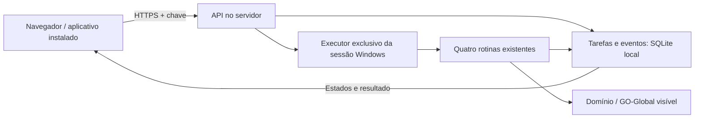

# Interface do usuário e executor dedicado

Entrega de 08/10/2026 no projeto existente. O usuário usa o navegador ou
instala a mesma interface como aplicativo (PWA). A execução fiscal fica
na sessão Windows do servidor; não precisa do Domínio no PC do usuário.
O site foi testado em navegador com executor simulado. O servidor
informado ainda precisa do Domínio configurado e de validação real.

Para o teste em dois PCs na mesma rede, o PC atual com Domínio pode
assumir temporariamente a execução. A conexão entre os PCs e os
instaladores Windows ainda precisam da rodada real do operador.

## Dois instaladores, dois papéis

| Computador | Instalador | Componentes |
| --- | --- | --- |
| PC com Domínio (servidor) | `Instalar Servidor.bat` | API, executor e configuração HTTPS; usa Python/OCR já preparados |
| Outro PC (interface) | `Instalar Interface.bat` | Atalho em janela própria pelo Edge/Chrome, endereço e confiança HTTPS local |

O PC da interface usa o navegador instalado. Não precisa de Python,
Git, Tesseract, Paddle ou Domínio. A interface pede a chave do servidor
ao abrir; ela continua somente na sessão da página.

Se alterar `data/servidor_chave.txt`, mantenha pelo menos **32 caracteres**,
sem acentos, em uma única linha. Salve, reinicie o servidor e informe a
nova chave no cliente. Uma chave curta ou com acentos impede o início;
o servidor explica o requisito e preserva o arquivo, sem mostrar seu conteúdo.

### Teste na mesma rede/Wi-Fi

No PC com Domínio:

1. Feche o servidor de teste anterior com Ctrl+C e rode `Atualizar.bat`.
2. Rode `Instalar Servidor.bat` e escolha **2 — interface em outro PC**.
   Confira o IPv4 detectado. Se houver mais de um, informe o da rede
   compartilhada pelos dois PCs; `ipconfig` mostra o endereço.
3. O instalador imprime o endereço e gera a pasta
   `data/rede_local/interface_cliente`. Copie **essa pasta inteira**
   para o outro PC. Ela contém o instalador, endereço e certificado
   público; não contém chave privada nem chave de acesso.
4. Clique com o botão direito em `atalhos/servidor/Liberar Acesso Rede.bat` e escolha
   **Executar como administrador**. A regra libera somente a porta,
   IP e Python configurados, para a sub-rede local, em perfil privado
   ou de domínio. Confira que esse Wi-Fi está como rede privada no Windows.
5. Abra `atalhos/servidor/Testar Interface na Rede.bat` e mantenha o Prompt aberto.

No outro PC:

1. Na pasta copiada, rode `Instalar Interface.bat`. O endereço já vem
   preenchido. O instalador confia na autoridade HTTPS pública gerada
   pelo servidor, para o usuário Windows atual; confira a origem do pacote.
2. Abra **Dominio - Interface**, criado na área de trabalho.
3. Entre com a chave de `data/servidor_chave.txt` do PC servidor.
4. Envie uma tarefa simulada para conferir conexão, etapas e histórico.

Após a conexão funcionar, encerre a simulação no servidor e abra
`atalhos/servidor/Executar Dominio na Rede.bat`, com Domínio calibrado/visível e empresa
correta. Execute individualmente, com apuração fechada, e confira o
documento/retorno. O cliente usa o mesmo endereço e chave.

Para mudar o endereço da interface, repita o instalador ou use
`scripts/instalar_interface.ps1 -Endereco https://ENDERECO:PORTA`.
Quando o endereço usa certificado HTTPS já confiável, o instalador
da raiz também aceita o endereço manual, sem pacote de autoridade local.

Se o IP do servidor mudar, rode `atalhos/servidor/Configurar Acesso Rede.bat`, repita a
regra de acesso e leve o pacote atualizado ao cliente. A autoridade
local é reutilizada, mantendo a confiança; não apague suas chaves para
renovar endereço. O certificado do servidor vale até um ano e a
autoridade até dois; arquivos inválidos/vencidos interrompem configuração.
Confiança pode ser removida em `certmgr.msc`, Autoridades de Certificação
Raiz Confiáveis, certificado `Dominio Automation Engine - Rede local`.

O pacote é um instalador leve da interface em janela do navegador;
a instalação PWA pelo menu do Chrome/Edge também continua disponível.
Não copia o motor fiscal. IP, arquivos locais e regra de firewall não
são configurados na nuvem nem no PC do usuário pelo Codex.




## Primeiro teste, mesmo sem Domínio

Na máquina que vai hospedar a interface:

1. Rode `Atualizar.bat` na pasta atual do projeto.
2. Rode `Instalar Servidor.bat` e escolha **1 — somente neste PC**.
   Instala componentes de API/HTTPS; não instala OCR, modelos ou Domínio.
3. Rode `atalhos/servidor/Testar Interface Servidor.bat` e mantenha o Prompt aberto.
4. Nesse computador, abra `http://127.0.0.1:8765` no navegador.
   Esse endereço é da instalação local, não do ambiente Codex.
5. Abra localmente `data/servidor_chave.txt`, gerado no primeiro início,
   e copie a chave para o campo de conexão. Não publique esse arquivo.
6. Selecione uma rotina, use o código fictício `9001` e confirme os
   campos. O teste mostra etapas, conclusão e histórico **simulados**.

O modo simulado não importa módulos de mouse/teclado, não acessa o
Domínio e não gera documento fiscal. O banco `data/servidor_simulado.sqlite3`
é separado do histórico de operação. Feche com Ctrl+C antes de abrir
outro servidor na mesma porta. `atalhos/servidor/Abrir Servidor.bat` inicia somente
consulta: lê o histórico de operação, mas não recebe execuções.

Depois da primeira instalação, `Atualizar.bat` também mantém as
dependências do servidor pelo marcador `data/servidor_instalado.json`.
Os atalhos usam o `python` do Prompt, seguindo o instalador existente.
Paddle é um ambiente opcional separado e não é requisito do site.

## Execução real no Windows

1. Configure acesso ao Domínio/GO-Global na sessão de usuário do servidor.
   Rode `Instalar.bat` e confira Tesseract com idioma português conforme
   o README.
2. No Domínio maximizado, com a tela azul vazia, rode
   `atalhos/ferramentas/Calibrar Tela Principal.bat`. Calibre **no servidor**, na resolução
   que será usada; não copie a referência do PC como prova de equivalência.
3. Encerre ferramentas/console de operação e deixe a empresa correta
   selecionada, com a tela azul visível, sem menu ou diálogo aberto.
4. Rode `atalhos/servidor/Executar Dominio no Servidor.bat`, volte ao Domínio e mantenha
   a sessão desbloqueada, visível e com resolução estável.
5. No site, informe o código da empresa selecionada. Teste primeiro
   SPED Fiscal individual em competência com apuração fechada. Confira
   documento, estados, log e retorno à tela principal.

O processo deve rodar na sessão do usuário, não como serviço Windows
sem desktop. Uma sessão bloqueada ou desconectada não oferece a tela
necessária ao RPA. Este incremento não configura o Domínio automaticamente.

Antes de chamar a rotina, o executor confere referência, foco, tela
principal e código da empresa. Se houver divergência, recusa a tarefa;
não troca a empresa automaticamente. SPED/Contribuições usam a
competência passada escolhida no calendário. Livros usam as datas informadas.
A confirmação de apuração é exigida: calendário não comprova fechamento.

Há uma tarefa por vez. Executor, GUI e ferramentas compartilham uma
trava na mesma instalação. Encerre o executor antes de calibrar ou operar
pela GUI. Use uma única pasta por sessão e não rode scripts fiscais
antigos em paralelo, pois eles não participam dessa trava.

## Controles, período e login pela interface (08/10/2026)

No servidor, execute `Atualizar.bat`, que instala a nova dependência
Playwright quando `data/servidor_instalado.json` existe. Caso esse
marcador não exista, use `Instalar Servidor.bat`. Não há novo instalador,
modelo OCR ou dependência a instalar no PC da interface. Playwright usa
Edge ou Chrome já instalado no servidor, em um perfil próprio local;
não requer `playwright install`. A wheel x64 e suas dependências foram
verificadas para Python 3.14. Reinicie o executor Windows após atualizar;
na interface use Ctrl+F5 para carregar os novos controles.

**Período:** SPED e Contribuições pedem mês/ano e derivam o primeiro e
último dia, inclusive ano bissexto. Livros pedem datas inicial/final.
Os campos começam vazios e são limpos após envio aceito. A API recusa
período atual, futuro, SPED de mês incompleto e apuração não confirmada.
Chamadas locais antigas sem datas preservam o mês anterior.

**Pausa:** aparece ao acompanhar a tarefa ativa. Pausa solicitada aguarda
o próximo ponto entre ações completas. Continuar retoma a mesma tarefa;
o adaptador exige foco e quadro compatíveis com o observado ao pausar,
mantendo a imagem apenas em memória. Se a tela mudou, interrompe, em vez
de executar uma ação com posição antiga. Encerrar o servidor durante
pausa interrompe a tarefa; não a retoma. Fechar a interface não pausa.

**Login:** abra Acesso ao Domínio e recuperação do servidor. A chave da
interface é diferente das credenciais Onvio e Domínio. Informe e-mail,
senha Onvio, usuário e senha Fiscal no formulário; não cole segredos em
chats. O fluxo segue as capturas do operador: Onvio/Entrar, credenciais,
método E-mail, código humano, Domínio Web/Entrar, Lista de Programas/
Escrita Fiscal, Conectando/credenciais/OK e tela principal azul.

Senhas ficam em memória durante a tentativa e são descartadas ao terminar.
O formulário também apaga senhas após envio. O código tem solicitação
única, prazo de cinco minutos e é consumido uma vez; não fica no histórico.
Reenvio de código expirado é recusado. Não há leitura automática de e-mail.
O login não dispara uma rotina fiscal automaticamente. Conectar em é
preservado: a captura mostrou Contábil e o operador orientou só credenciais
e OK. O teclado Fiscal atual admite ASCII imprimível; recusa outros
caracteres antes de digitar. Credenciais web usam preenchimento DOM.

Somente destinos HTTPS conhecidos recebem credenciais. Campos web são
localizados por rótulo/semântica. Lista de Programas e Conectando usam
OCR exato e único; os campos são medidos pelos retângulos ao lado dos
rótulos, sem coordenadas inventadas. Ambiguidade interrompe o login e
mostra a etapa. A confirmação final exige referência calibrada.

**Conferência/calibração remota:** Ver tela do Domínio captura apenas
a janela Domínio/Lista de Programas/Conectando reconhecida, quando a
sessão está livre. A imagem fica em memória por até 30 segundos e é
entregue somente ao cliente autenticado; não vai para IA, Git ou logs.
A interface a oculta após 30 segundos ou por Ocultar captura. Não captura
o navegador com credenciais. Confira a tela azul nessa imagem, confirme
a caixa e use Calibrar tela principal. Maximiza somente o Domínio
identificado e reaproveita as duas capturas/foco/cabeçalho da calibração
existente. Não aprende a referência automaticamente durante login.

**Reiniciar ciclo:** exige credenciais e confirmação de fechamento.
Interrompe a tarefa num checkpoint e marca pendentes como interrompidas,
sem repetir geração. Fecha as janelas Domínio/Lista de Programas
identificadas e o navegador próprio do RPA, sem matar processos do Windows.
Espera o fechamento antes de abrir outro ciclo. Se uma janela pedir
confirmação e continuar aberta, informa falha. Durante login ativo, use
Cancelar login e aguarde o fim antes de Reiniciar ciclo. Leitores PDF e
outros programas não identificados ficam fora dessa operação.

**Novas rotinas:** Configurar novas rotinas salva nome, cliques por texto,
hover por texto, teclas de formulário e parâmetros de empresa/período no
mesmo `data/rotinas_gravadas/` do gravador. Não aceita código Python,
caminhos enviados pelo cliente nem senhas literais. Nasce rascunho;
revisão, teste supervisionado e aprovação seguem o fluxo local existente.
Esse catálogo ainda não executa rascunhos remotamente. Lote remoto por
regime e agendamento são as próximas entregas descritas no roadmap.

**Menus:** `data/mapa_menus.json` aprende regiões de alvos dos caminhos
já conhecidos, depois de localizar por OCR. A leitura seguinte começa
no recorte, relê o alvo e recai na região original quando necessário;
resolução diferente invalida o recorte. Abertura dos submenus usa polling
visual em vez das esperas fixas de dois segundos. Preserva clique em L,
formulários, conferências e recuperação. Tempo real ainda precisa ser
medido no Windows; não significa que todos os menus foram mapeados.

Testes automatizados e Chromium usam fiscal/login externos simulados.
Regressão: `python -m unittest discover -s tests -q`.
Teste opcional do navegador: `python tests/smoke_interface_web.py`, com
Chromium instalado ou `DOMINIO_BROWSER_BIN` apontando ao executável do
Chrome/Edge. O teste cria API/banco temporários, não usa a chave real,
não opera o desktop fiscal nem envia credenciais a provedores externos.
Também foi conferida a entrada CLI `scripts/servidor.py --simular`: site,
JavaScript, API autenticada e tarefa sintética com seis eventos.
O caminho completo Onvio/GO-Global, reconhecimento dos novos campos,
eventual confirmação de abertura do cliente remoto pelo navegador e
velocidade de menus ainda precisam da primeira rodada Windows.
Servidor dedicado continua precisando de sessão gráfica desbloqueada,
mesmo quando o usuário só vê a interface em outro PC.

## Endereço e aplicativo no PC do usuário

O endereço padrão aceita somente o próprio servidor. Para outro PC,
configure HTTPS e um endereço acessível ao usuário. Pode usar proxy
HTTPS encaminhando para a API local na porta 8765, ou HTTPS no próprio
processo com certificado e chave PEM válidos:

```powershell
python scripts\servidor.py --executar --host 0.0.0.0 --porta 8765 --certificado C:\certificados\servidor.pem --chave-tls C:\certificados\servidor-key.pem
```

Antes de configurar o Domínio, substitua `--executar` por `--simular`.
Sem certificado/chave, o script recusa um endereço externo. Configure
o certificado para o nome usado pelos PCs e o acesso necessário no
servidor. Endereço, certificado e publicação na rede ainda estão pendentes.

No Chrome/Edge, abra o endereço HTTPS e use **Instalar no computador**
quando disponível, ou a opção de instalação do navegador. O aplicativo
usa a mesma API. Somente a interface estática fica disponível offline;
chave, pedidos, histórico e arquivos fiscais não entram no cache.
Sem conexão, novos comandos ficam bloqueados.

## Resultados e retomada

- O histórico persiste no servidor e mostra as últimas 100 tarefas.
  Consultar uma tarefa não repete a execução.
- Repetir um envio incerto com os mesmos campos reutiliza o identificador;
  pedidos idênticos com ele representam uma tarefa. Confira o histórico
  antes de enviar outra execução.
- Reiniciar o executor marca tarefas inacabadas como interrompidas;
  não as executa automaticamente de novo.
- Conclusão exige resultado positivo da rotina e retorno reconhecido.
  Falha, recusa e resultado desconhecido têm estados distintos.
- Download aparece quando a rotina devolve um caminho registrado dentro
  de `saida/`. SPED/Contribuições hoje devolvem booleano, sem caminho.
- A conferência de período dos PDFs continua pendente. Recuperação da
  tela não transforma uma falha em sucesso.
- Desconectar ou fechar o navegador não cancela a rotina. Ctrl+C no
  servidor aguarda a ação em andamento terminar.

Log técnico: `data/servidor.log`. Evidências fiscais continuam nos
arquivos locais usados pelo motor. A API publica eventos estruturados,
sem captura, OCR livre ou caminho privado.

## Escopo e validação

As quatro funções remotas são SPED Fiscal, EFD Contribuições, Registro
de Saídas e Registro de Entradas. Lote não é prioridade nem aparece no
site. Gravação, revisão e aprovação continuam na GUI local; rotinas
gravadas não entram automaticamente no catálogo remoto.

A conexão usa uma chave do escritório, mantida somente em memória no
navegador. Contas individuais, permissões por usuário, publicação no
servidor real e agentes operadores gerais ainda não foram implementados.
Essa entrega prepara interface/executor sem concluir todas as etapas do RPA.

244 testes da entrega inicial passaram, além de navegação real em Chromium
com execução simulada e visual em 1440/900/390 pixels; ciclo Tk real com
backend fiscal simulado. Instalação e execução fiscal Windows desta
versão ainda precisam de validação na máquina dedicada.

A configuração da rede acrescenta testes de certificado/cadeia/SAN,
TLS real com hostname correto/divergente, reutilização da autoridade,
pacote cliente público, corrupção e escrita atômica. A liberação do
firewall, importação da confiança e atalho precisam de validação Windows.
