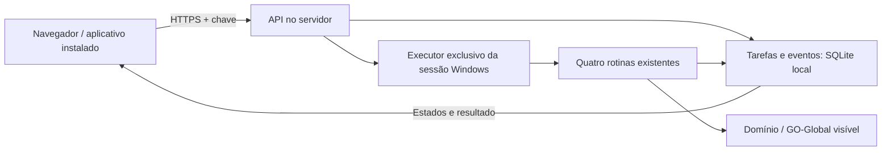

# Interface do usuário e executor dedicado

Entrega de 08/10/2026 no projeto existente. O usuário usa o navegador ou
instala a mesma interface como aplicativo (PWA). A execução fiscal fica
na sessão Windows do servidor; não precisa do Domínio no PC do usuário.
O site foi testado em navegador com executor simulado. O servidor
informado ainda precisa do Domínio configurado e de validação real.




## Primeiro teste, mesmo sem Domínio

Na máquina que vai hospedar a interface:

1. Rode `Atualizar.bat` na pasta atual do projeto.
2. Rode `Instalar Servidor.bat`. Instala somente as dependências da API;
   não instala OCR, modelos, Domínio ou outro projeto.
3. Rode `Testar Interface Servidor.bat` e mantenha o Prompt aberto.
4. Nesse computador, abra `http://127.0.0.1:8765` no navegador.
   Esse endereço é da instalação local, não do ambiente Codex.
5. Abra localmente `data/servidor_chave.txt`, gerado no primeiro início,
   e copie a chave para o campo de conexão. Não publique esse arquivo.
6. Selecione uma rotina, use o código fictício `9001` e confirme os
   campos. O teste mostra etapas, conclusão e histórico **simulados**.

O modo simulado não importa módulos de mouse/teclado, não acessa o
Domínio e não gera documento fiscal. O banco `data/servidor_simulado.sqlite3`
é separado do histórico de operação. Feche com Ctrl+C antes de abrir
outro servidor na mesma porta. `Abrir Servidor.bat` inicia somente
consulta: lê o histórico de operação, mas não recebe execuções.

Depois da primeira instalação, `Atualizar.bat` também mantém as
dependências do servidor pelo marcador `data/servidor_instalado.json`.
Os atalhos usam o `python` do Prompt, seguindo o instalador existente.
Paddle é um ambiente opcional separado e não é requisito do site.

## Execução real no Windows

1. Configure acesso ao Domínio/GO-Global na sessão de usuário do servidor.
   Rode `Instalar.bat` e confira Tesseract com idioma português conforme
   o README.
2. No Domínio maximizado, com a tela azul vazia, rode
   `Calibrar Tela Principal.bat`. Calibre **no servidor**, na resolução
   que será usada; não copie a referência do PC como prova de equivalência.
3. Encerre ferramentas/console de operação e deixe a empresa correta
   selecionada, com a tela azul visível, sem menu ou diálogo aberto.
4. Rode `Executar Dominio no Servidor.bat`, volte ao Domínio e mantenha
   a sessão desbloqueada, visível e com resolução estável.
5. No site, informe o código da empresa selecionada. Teste primeiro
   SPED Fiscal individual em competência com apuração fechada. Confira
   documento, estados, log e retorno à tela principal.

O processo deve rodar na sessão do usuário, não como serviço Windows
sem desktop. Uma sessão bloqueada ou desconectada não oferece a tela
necessária ao RPA. Este incremento não configura o Domínio automaticamente.

Antes de chamar a rotina, o executor confere referência, foco, tela
principal e código da empresa. Se houver divergência, recusa a tarefa;
não troca a empresa automaticamente. SPED/Contribuições usam o mês
anterior do relógio do servidor. Livros usam as datas informadas.
A confirmação de apuração é exigida: calendário não comprova fechamento.

Há uma tarefa por vez. Executor, GUI e ferramentas compartilham uma
trava na mesma instalação. Encerre o executor antes de calibrar ou operar
pela GUI. Use uma única pasta por sessão e não rode scripts fiscais
antigos em paralelo, pois eles não participam dessa trava.

## Acesso pelo PC do usuário

O endereço padrão aceita somente o próprio servidor. Para outro PC,
configure HTTPS e um endereço acessível ao usuário. Pode usar proxy
HTTPS encaminhando para a API local na porta 8765, ou HTTPS no próprio
processo com certificado e chave PEM válidos:

```powershell
python scripts\servidor.py --executar --host 0.0.0.0 --porta 8765 --certificado C:\certificados\servidor.pem --chave-tls C:\certificados\servidor-key.pem
```

Antes de configurar o Domínio, substitua `--executar` por `--simular`.
Sem certificado/chave, o script recusa um endereço externo. Configure
o certificado para o nome usado pelos PCs e o acesso necessário no
servidor. Endereço, certificado e publicação na rede ainda estão pendentes.

No Chrome/Edge, abra o endereço HTTPS e use **Instalar no computador**
quando disponível, ou a opção de instalação do navegador. O aplicativo
usa a mesma API. Somente a interface estática fica disponível offline;
chave, pedidos, histórico e arquivos fiscais não entram no cache.
Sem conexão, novos comandos ficam bloqueados.

## Resultados e retomada

- O histórico persiste no servidor e mostra as últimas 100 tarefas.
  Consultar uma tarefa não repete a execução.
- Repetir um envio incerto com os mesmos campos reutiliza o identificador;
  pedidos idênticos com ele representam uma tarefa. Confira o histórico
  antes de enviar outra execução.
- Reiniciar o executor marca tarefas inacabadas como interrompidas;
  não as executa automaticamente de novo.
- Conclusão exige resultado positivo da rotina e retorno reconhecido.
  Falha, recusa e resultado desconhecido têm estados distintos.
- Download aparece quando a rotina devolve um caminho registrado dentro
  de `saida/`. SPED/Contribuições hoje devolvem booleano, sem caminho.
- A conferência de período dos PDFs continua pendente. Recuperação da
  tela não transforma uma falha em sucesso.
- Desconectar ou fechar o navegador não cancela a rotina. Ctrl+C no
  servidor aguarda a ação em andamento terminar.

Log técnico: `data/servidor.log`. Evidências fiscais continuam nos
arquivos locais usados pelo motor. A API publica eventos estruturados,
sem captura, OCR livre ou caminho privado.

## Escopo e validação

As quatro funções remotas são SPED Fiscal, EFD Contribuições, Registro
de Saídas e Registro de Entradas. Lote não é prioridade nem aparece no
site. Gravação, revisão e aprovação continuam na GUI local; rotinas
gravadas não entram automaticamente no catálogo remoto.

A conexão usa uma chave do escritório, mantida somente em memória no
navegador. Contas individuais, permissões por usuário, publicação no
servidor real e agentes operadores gerais ainda não foram implementados.
Essa entrega prepara interface/executor sem concluir todas as etapas do RPA.

244 testes locais/simulados passaram, além de navegação real em Chromium
com execução simulada e visual em 1440/900/390 pixels; ciclo Tk real com
backend fiscal simulado. Instalação e execução fiscal Windows desta
versão ainda precisam de validação na máquina dedicada.
